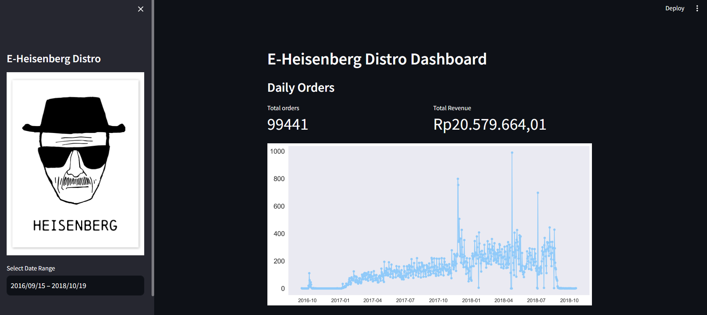
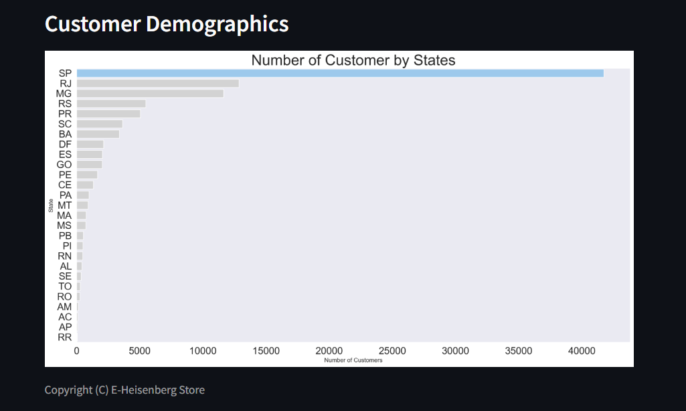
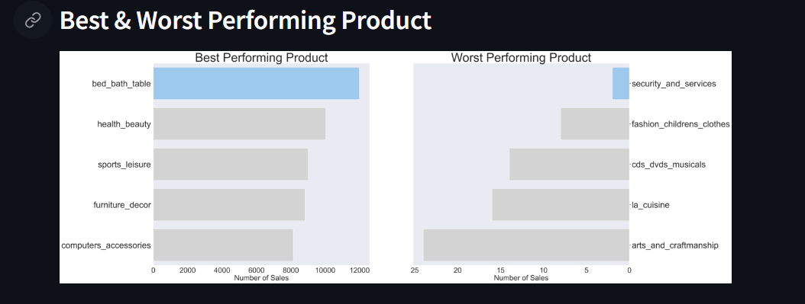

# E-Commerce Data Analysis Project

## Project Overview

This project involves analyzing an e-commerce dataset to gain insights into the company's sales performance, revenue, product popularity, and customer demographics. The project concludes with the creation of an interactive dashboard using Streamlit, which allows for a visual exploration of the data and findings.

## Business Questions

The analysis focuses on addressing the following key business questions:

1. **What was the Sales Performance and Company Revenue in 2018?**
   - This question aims to evaluate the company's overall sales performance throughout the year 2018. By analyzing the daily orders and total revenue, we can identify trends, peak periods, and the overall financial health of the company during this time.

2. **Which Products Were the Best-Selling and Least-Selling?**
   - Understanding product performance is crucial for inventory management, marketing strategies, and customer satisfaction. This question seeks to identify the products that were most popular and those that struggled to sell, providing valuable insights for decision-making.

3. **What Are the Demographics of Our Customers?**
   - Customer demographics play a vital role in targeted marketing and customer relationship management. This analysis helps to uncover which regions or states have the highest concentration of customers, enabling the company to tailor its services and marketing efforts accordingly.

## Data and Methodology

The project uses a public e-commerce dataset, which includes information about customer orders, product categories, and sales data. The analysis was conducted using Python, with libraries such as Pandas, Matplotlib, and Seaborn for data manipulation and visualization.

### Steps Involved:

1. **Data Cleaning and Preparation:**
   - The raw data was cleaned to remove any inconsistencies or missing values. Necessary transformations were applied to ensure that the data was in a usable format for analysis.

2. **Exploratory Data Analysis (EDA):**
   - A thorough exploration of the data was conducted to understand the distribution of sales, revenue, and customer demographics.

3. **Visualization:**
   - Various visualizations were created to represent the findings clearly. These visualizations include bar charts, line graphs, and more, providing a comprehensive view of the data.

4. **Dashboard Creation:**
   - The analysis culminates in the creation of an interactive dashboard using Streamlit. This dashboard allows users to interact with the data, explore different aspects of the business, and gain insights in real time.

## Results

The following are some of the key insights derived from the analysis:

- **Sales Performance and Revenue:**
  - In 2018, the company processed a total of 99,441 orders, generating a total revenue of approximately Rp20,579,664,01. The daily orders and revenue trends were visualized to identify peak sales periods and revenue fluctuations.

- **Best and Worst Performing Products:**
  - The analysis revealed that the **Bed Bath Table** category was the best-selling product, while **Security and Services** had the least number of sales. These insights can guide inventory and marketing strategies.

- **Customer Demographics:**
  - The majority of the company's customers were concentrated in **São Paulo (SP)**, followed by **Rio de Janeiro (RJ)** and **Minas Gerais (MG)**. This demographic information is crucial for targeted marketing and expanding the customer base in other regions.

## Dashboard

The final deliverable of the project is an interactive dashboard created with Streamlit. The dashboard features:

- **Customer Demographics:** A bar chart showing the number of customers by state.
- **Best & Worst Performing Products:** Side-by-side bar charts depicting the best and worst-performing product categories.
- **Sales and Revenue Trends:** A time-series plot showing the daily orders and total revenue over time.

### Screenshots

## Conclusion

This project provided valuable insights into the company's sales, product performance, and customer demographics. The interactive dashboard serves as a powerful tool for decision-makers to explore the data and derive actionable insights.

